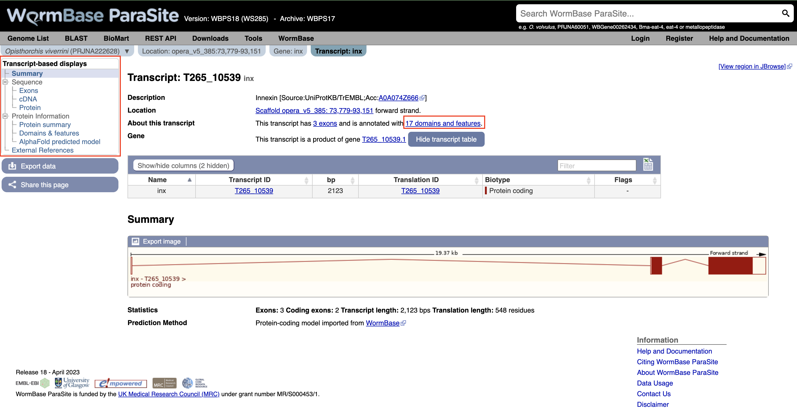
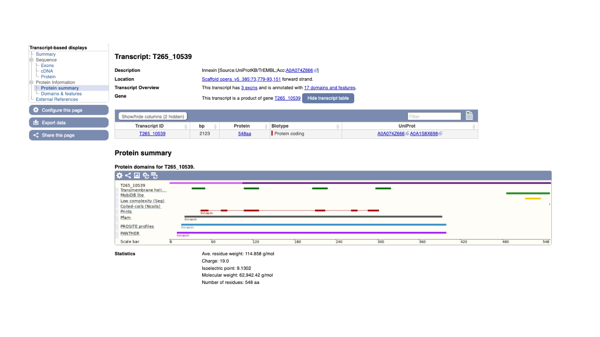
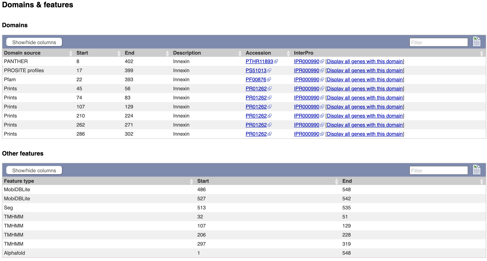
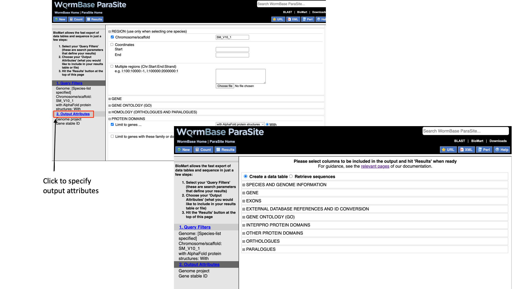
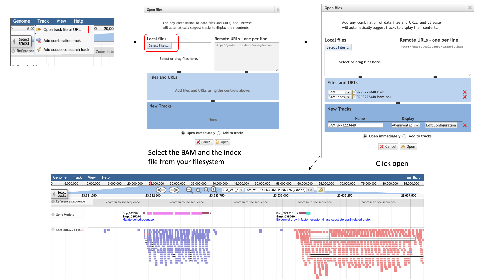
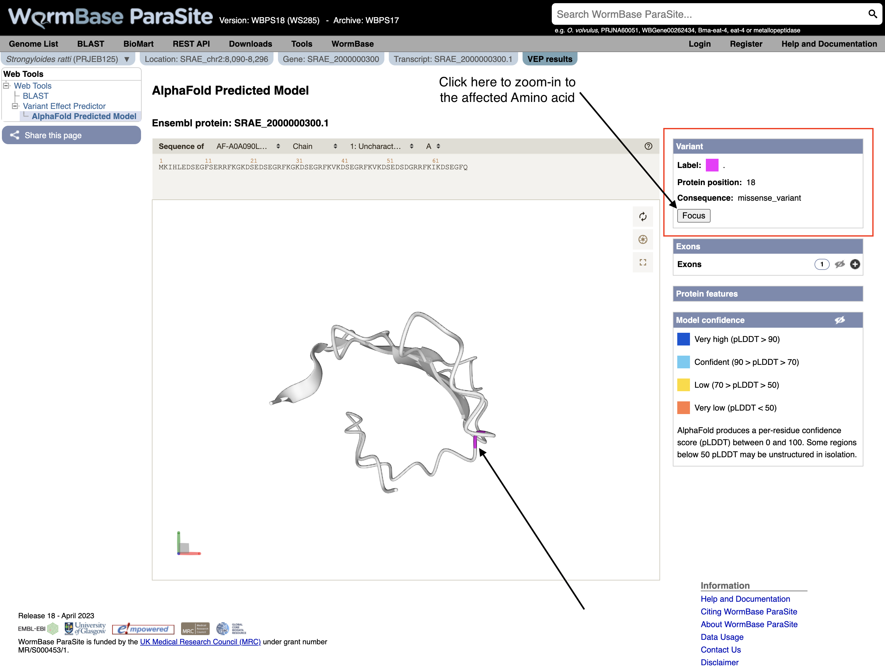
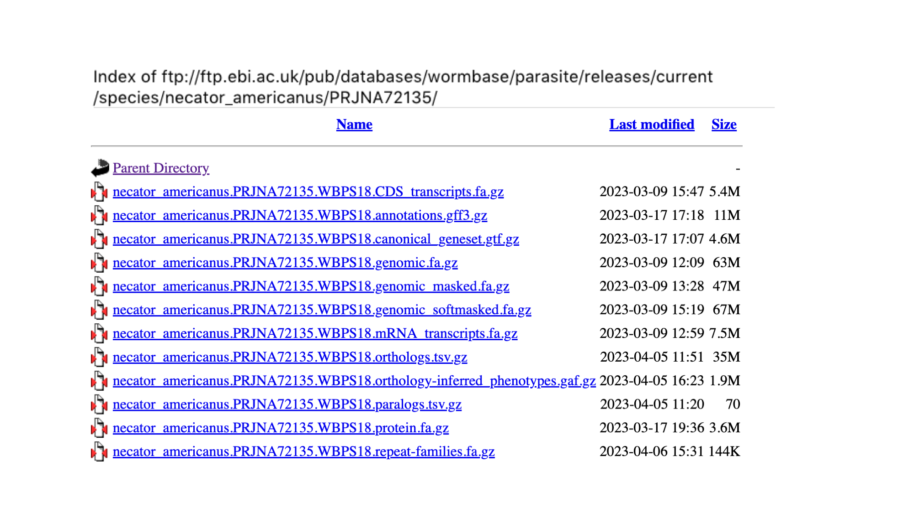
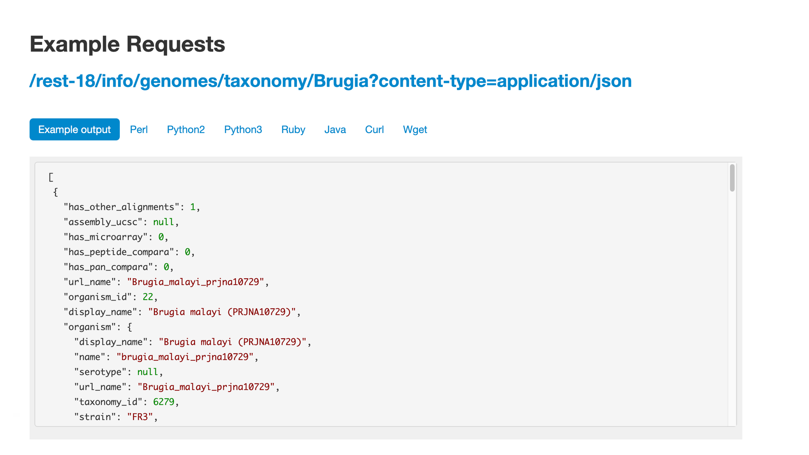
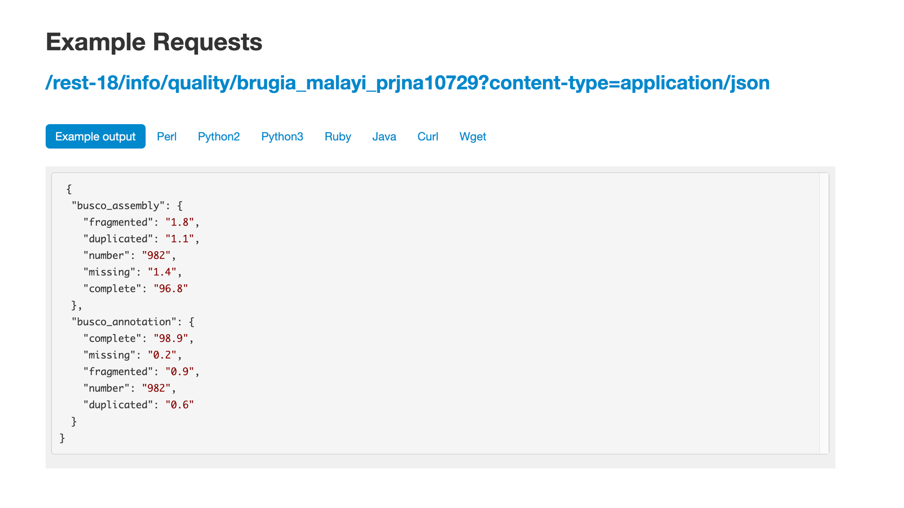

# WormBase ParaSite

## Table of contents
1. [Overview and Aims](#intro)
2. [Genes and genomes](#genes_and_genomes)
    * [Genes: the basics](#basics_genes)
    * [Genomes: the basics](#basics_genomes)
    * [Sequence databases](#sequence_databases)
3. [Looking at genomes in WormBase ParaSite](#wbps_genomes)
    * [EXERCISE](#genomes_exercise)
    * [Submit a genome to WormBase ParaSite](#submit_genome)
4. [Looking at genes in WormBase ParaSite](#wbps_genes)
    * [The gene page](#gene_page)
    * [Functional annotation: protein domains and GO terms](#functional_annotation)
    * [Gene Ontology terms](#go_terms)
    * [Protein domains](#protein_domains)
    * [AlphaFold 3D protein structures](#af)
    * [Orthologues and paralogues](#comparative_genomics)
    * [EXERCISE](#gene_page_exercise)
5. [BioMart](#biomart)
    * [EXERCISE](#biomart_exercise)

## 1. Overview and Aims <a name="intro"></a>
We'll start by reviewing the basics on genes and genomes: what they are, how we represent and talk about them, and how we go from a DNA sequence- a string of letters- to making predictions about gene function. We'll look at this in the context of WormBase ParaSite and other online database resources. 

WormBase ParaSite gathers together nematode and flatworm genomes that have been assembled and annotated by the research community, adds additional analyses and makes these data available to the scientific community. We'll look at the kind of data you can retrieve, initially by exploring the website. In the last part of the module we'll introduce BioMart. This is a data-mining tool that allows you to retrieve WormBase ParaSite data in bulk.

---
## 2. Genes and Genomes  <a name="genes_and_genomes"></a>

Throughout this course, we'll assume that you're familiar with genes and genomes. 

### Genes: the basics  <a name="basics_genes"></a>

A **gene** is a unit of the genome, a DNA sequence, that is transcribed into an RNA molecule, or a transcript. A gene's transcript may go on to be translated into a protein (in that case it is an mRNA), or it may have a role as a non-coding RNA, such as a ribosomal RNA (rRNA), transfer RNAs (tRNA), microRNA (miRNA), or long non-coding RNA (lncRNA).

In eukaryotes, most protein-coding genes comprise alternating **exons** and **introns** (some genes have a single exon), flanked by **untranslated regions** (UTRs). The exons constitute the parts of the gene that are translated into a polypeptide. Introns are transcribed but soon after excised and the final mature mRNA is formed by a 5’UTR, joined exons and a 3’UTR. A CAP and poly-A tail are added to the 5’ and 3’ ends respectively. These structures are essential to guarantee the molecular stability and downstream processing of the mRNAs.


This figure represents the steps that are needed to transform information encoded in the DNA into a polypeptide and eventually a functional protein. The starting information is encoded in the genome. A gene encodes, among other things, the transcription start and transcription end. Transcription produces an RNA copy of the gene, known as pre-mRNA, which comprises exons and introns. Mature mRNA is produced by splicing together exons, removing introns, adding a CAP at the 5’ end, and polyadenylating the 3’end, to add a poly(A) tail. The mature mRNA is the template for the translation into a polypeptide by the ribosome.

---
### Genomes: the basics  <a name="basics_genomes"></a>

In the cell, genomes are organised into chromosomes. In practice, current DNA sequencing methods are unable to read the DNA sequence of a whole chromosome without errors. We therefore use the technique of sequencing shorter segments of chromosomes, and do it in such a way that the segments overlap and can be pieced together like a jigsaw puzzle. This process is referred to as genome assembly. For now, we will focus on what genome assemblies look like, and how they are represented in genome databases. 

The diagram below shows the structure of a typical assembly. It has 3 layers: the contigs are stretches of contiguous DNA sequence without gaps. The scaffolds are ordered sets of contigs separated by gaps of estimated length. In order to make scaffolds from contigs, techniques such as optical mapping and Hi-C are used. Finally, the chromosome is an ordered set of scaffolds separated by gaps on unknown length. To make the chromosome sequence from the scaffold, techniques such linkage mapping and FISH are used.


Sometimes, there is insufficient (or no) data to reliably place a scaffold into a specific position on a chromosome. In the figure above, this is true of the scaffold on the right. The assembly above therefore comprises 2 top-level sequences: 1 chromosome, and one unplaced scaffold.

---
### Sequence databases <a name="sequence_databases"></a>

As technology has evolved, there has been an explosion in the number of genomes that have been sequenced. Sequence databases provide a place where these sequences can be deposited, stored and made available to the world. There are three widely-used nucleotide repositories (or primary databases) for the submission of nucleotide and genome sequences:

* [GenBank](https://www.ncbi.nlm.nih.gov/genbank), hosted by the National Center for Biotechnology Information (or NCBI).
* The [European Nucleotide Archive (ENA)](http://www.ebi.ac.uk/ena), hosted by the European Molecular Biology Laboratories (EMBL).
* The [DNA Data Bank of Japan (DDBJ)](http://www.ddbj.nig.ac.jp),  hosted by the National Centre for Genetics.

Together they form the [International Nucleotide Sequence Database Collaboration](http://www.insdc.org/about) and luckily for users, they all “mirror” each other. This means that irrespective of where a sequence is submitted, the entry will appear in all three databases. Once data are deposited in primary databases, they can be accessed freely by anyone around the world.

WormBase ParaSite takes sequencing data from INSDC (a genome assembly and a set of gene predictions) and adds additional value by performing additional analyses and making the data available in a user-friendly interactive way. In this part of the workshop, we will explore the basic functionality of the website for looking at helminth genomes and genes.

[↥ **Back to top**](#top)

---
## 3. Looking at genomes in WormBase ParaSite <a name="wbps_genomes"></a>

In this section, we’ll explore how genome assemblies are presented in WormBase ParaSite, and look at some commonly used metrics of assembly quality.

In an ideal world, each genome assembly would fully reconstruct contiguous chromosomes. Many of the genomes in WormBase ParaSite are much more fragmented than this; a chromosome might actually be represented by hundreds or even thousands of smaller scaffolds or contigs. Having a more fragmented genome makes identifying genes much more challenging, as gene models are more likely to be split across scaffolds. 

1. From the WormBase ParaSite homepage, click either the ”Genome List” tab in the tools bar, or the “Genomes” icon.


This will take you to a list of all of the genomes currently available in WormBase ParaSite, divided phylogenetically into the phyla *Nematoda* and  *Platyhelminthes*.

Table Features:

- **Species with multiple entries**: You might notice that some species (like _Ancylostoma ceylanicum_ in the figure below) have two entries: this is because the research community has produced two different reference assemblies for these genomes, and WormBase ParaSite makes them both available.
- **Link to the sequence archive**: In this table you can also find a link to the sequence archive where the genome sequence was originally deposited (‘BioProject ID’).
- **Links to two different genomes browsers**, JBrowse and Ensembl. We’ll cover the use of genome browsers to visualise genomes later.
- **Genomes statistics**: The ‘BUSCO ASSEMBLY’, ‘BUSCO ANNOTATION’ and ‘N50’ columns give some statistics about the quality of the genome assembly. More statistics can be loaded by using the "Show/hide" columns drop-down menu at the top of the table. We will cover exactly what these values mean below.
- **Sortable/Searchable**: You can sort the tables based on any column including the columns showing genomes' statistics (For example sort the columns from the highest to the lowest N50 value). You can also use the top-right "Filter" text box to search any column.


2\. Scroll down the page to find _Brugia malayi_ and click the species name link- this will take you to the _B. malayi_ genome landing page.


The genome page has useful summary information about the species and the assembly. You can see a summary of the methods used to produce the assembly and the annotation, and links to the publication describing it in more detail (where this is available).
3\. Look now at the ‘Assembly statistics’ box.


The information in this box tells us about two metrics related to the quality of the assembly: contiguity and completeness.<br>
- **Contiguity** describes how many scaffolds a genome is represented by: in a perfectly contiguous reference genome, the number of scaffolds would be equal to the number of chromosomes. Contiguity is described by several values, including the total number of scaffolds in the assembly, the length of the longest scaffold, the N50 and the N90. The N50 describes the midpoint of the assembly, such that, if all of the scaffolds of the assembly were lined up in size order, the N50 is the length of the scaffold above which 50% of the bases are found. Similarly, 90% of bases are found in scaffolds greater than or equal to the N90 length. For a given genome, larger N50 and N90 lengths therefore indicate more contiguous assemblies. 
   <br>
   <br>
   In the “Assembly statistics” widget, the circumference of the circle represents the whole genome assembly, with scaffolds ordered from longest to shortest. The diameter of the grey colour represents the length of the scaffold represented at each point of the circle. The light grey shading represents the N90 scaffold, whilst the dark grey shading represents the N50 scaffold. The light blue outer ring shows the GC/AT/N percentage of the scaffold.
   <br>
   <br>
   Mouse over the widget to explore the number of scaffolds contributing to the genome. You should see that the N50 length (14.2 Mb) is the third longest scaffold, and the N90 length (13.5 Mb) is the fifth longest scaffold.
   <br>
   <br>
- **Completeness**: BUSCO is a method of assessing genome completeness based on the principle that some genes are so highly conserved across eukaryotic species that they should be present in any genome assembly, in single copy. Generally speaking, a higher percentage of single BUSCO genes, indicates a higher quality assembly. BUSCO ASSEMBLY does not take account the genome's provided gene models, assessing the assembly quality of a genome by predicting a gene-set ab initio using AUGUSTUS. BUSCO ANNOTATION, on the other hand, is running at the protein level, assessing not only the assembly quality of a genome but also the quality of its annotation.
    <br>
    <br>
    A word of warning though: BUSCO scores can be misleading for certain taxonomic groups. Although the genes are selected because they are supposed to be universally conserved, this is not always the case. Platyhelminth genomes tend to have lowerBUSCO scores; this is not necessarily because the genomes are lower quality, but because some highly conserved eukaryotic genes are truly absent from this group of organisms.
<br><br>

---
#### Genome assembly metrics exercise <a name="genomes_exercise"></a>

1\. Find the two other genome assemblies from different _Brugia_ species in WormBase ParaSite, which are of lower quality than _Brugia malayi_.
2\. According to their scaffold statistics and BUSCO scores, which of these two assemblies is more contiguous and complete?

---
## 4. Looking at genes in WormBase ParaSite <a name="wbps_genes"></a>
For each genome in WormBase ParaSite, there are gene and transcript pages available for browsing. The aim of this section is to familiarise you with retrieving information about a gene of interest from WormBase ParaSite.

### The Gene Page <a name="gene_page"></a>
We will use a walk through example to illustrate how to use the website to find out about the function of an _Opisthorcis viverrini_ gene.

#### Basic Navigation
1. Open up a web browser, and type this URL into the address bar: https://parasite.wormbase.org/

The page should look something like this:

  

2\. Paste "T265_10539" into the search bar in the top right of the page and click return. T265_10539 is a stable (i.e. permanent) identifier for a gene. These identifiers are usually allocated by the scientist or group that sequenced and annotated the genome.

  

You should get one result, matching a gene in *Opisthorchis viverrini*, the Southeast Asian liver fluke. Let's look at the page for the T265_10539 gene:

3\. Click T265_10539

Every gene in WormBase ParaSite has a gene page, which presents sequence data and a summary of information from various sources about the gene.


The gene page has three main sections. In the summary section, together with the description of our gene we can also see the genomic location of the gene ("opera_v5_385", in this case) and the INSDC Sequence ID. This is an identifier that links to an entry for the scaffold in the ENA.

Underneath, we can see some information about the gene: it has one transcript isoform and a number of orthologues and paralogues. We’ll revisit this later. We can also see that the gene is protein-coding.

On the left, we have a navigation menu, which can be used to explore the information that is available for each gene. We’ll be going through each of these menu options in turn.

The “Genomic context” image underneath shows us a snapshot of the scaffold that our gene is on.

4\. Click the ‘Region in Detail’ link in the “Genomic context” section. <a name="genome_browser"></a>


Here, each of the three boxes gives us an increasingly zoomed-in view of the gene’s genomic position. The top box shows the whole scaffold, and the middle box below it shows a zoomed-in part of the scaffold. In this case, the scaffold ("opera_v5_385") is short so the middle box is showing the whole scaffold. Looking at the middle box, it shows us that out gene of interest is located approximately a quarter of the way along the scaffold. The bottom box shows us the structure of the gene model.

We can see that:

- The gene is on the forward strand - you can see this from the ‘>’ symbol located next to the gene name in the protein coding genes track.
- The gene has three exons in total, of which 2 contain coding sequence. Both 5' and 3' UTRs (untranslated regions) are annotated.

You can learn more about the Genome Browser [here](https://parasite.wormbase.org/info/Browsing/genome_browser_ensembl.html).

<details closed>
<summary>Sneak peek</summary>
There is an alternative interactive Genome Browser in WormBase ParaSite that can be accessed by the "View region in Jbrowse" button at the top-right of the gene page but we're going to talk about it in our next module!
</details>
<br>

5\. Navigate back to the gene page by clicking the "Gene:inx" tab at the top of the page.

As well as gene pages, WormBase ParaSite has a page for each transcript that a gene produces. In this case, only one transcript isoform has been annotated.

6\. On the gene page, click the "Show transcript table" button to show the trancript table. Then click the transcript ID in the transcipt table to navigate to the transcript page.


Again using the navigation menu on the left hand side of the page, we can retrieve three main types of information on the transcript: sequences, information about the protein domains, and external references.



7\. Click “Exons”, “cDNA” and “Protein” in the “Sequence” section of the navigation menu to see the different types of sequence that are available for the transcript.


- The “Exons” tab displays the sequence of individual exons in a table (useful if you’re interested in retrieving, say, only the sequence of exon 2). 
- The “cDNA” tab has the cDNA sequence (the sequence you would get if you reverse transcribed mature mRNA).
- The “Protein” tab has the amino acid sequence. All of the sequences can be downloaded in FASTA format - this is a text format that is widely used for representing sequences. It consists of a header line (a “>” character and a description or name of the sequence) followed by the sequence itself on the next line. As well as the sequences displayed in the browser, you can also choose to download, for example, genomic sequence, just UTRs etc.

Many users use sequences retrieved from these pages to design primers.


Note that this protein sequence is what is known as a conceptual translation: the amino acids have not been sequenced directly, but we can infer the sequence given the predicted structure of the gene (the coordinates of the introns and exons), the underlying DNA sequence and a given codon usage table.

[↥ **Back to top**](#top)

---
#### Functional annotation: Gene Ontology (GO) terms, protein domains and protein structure <a name="functional_annotation"></a>

So far we have gathered general information about this _Opisthorcis viverrini_ gene. We have also inspected their genomic location and sequence. However, we don't have any clues about the genes' function! What does the protein encoded from this gene do?


##### Gene ontology (GO) <a name="go_terms"></a>

A fast way to find out about the function of a gene’s product is to see which Gene Ontology (GO) terms have been associated with it. GO is a project that seeks to describe complex biology in a logical and consistent way that is humanreadable and and computer-processable. GO is a controlled vocabulary, whereby gene products are associated with GO terms that describe their function. There are three aspects to GO: Cellular Component, Molecular Function and Biological Process. Cellular Component GO terms describe where a protein is localised (in the membrane, extracellular, in the nucleus etc). Molecular Function GO terms describe the biochemical activity of the protein. Biological Process GO terms describe the pathways and broader processes that the protein contributes to.

1. Click the “Gene:inx” tab at the top of the page to return to the main gene page, then select "Biological process" and/or “Cellular component” from the Gene Ontology section of the navigation menu.


WormBase ParaSite imports GO annotations from three sources:
- Terms assigned by UniProt
- Terms inferred by the protein’s InterPro domains (more about this in the next section)
- Terms that have been associated with orthologues of the gene of interest.

The GO terms associated with this gene make sense given what we already know about the Innexin protein family: this protein likely forms part of the gap junction, which is a channel connecting the cytoplasm of two cells.

---
##### Protein Features and Domains <a name="protein_domains"></a>

For the vast majority of predicted protein sequences, experiments to determine function have not yet been performed. However, we can use **homology** to take proteins that are well-studied in one experimental system and infer that proteins of similar sequence in other organisms are likely to have similar structure, and therefore similar function.

Protein sequences are commonly analysed by looking at their domains - subsequences of a protein that have a defined tertiary structure or sequence motif and confer a defined function. A protein can consist of several domains. When comparing proteins between organisms, often the region encoding a protein domain is highly conserved whilst the bit that connects different domains together is more divergent.

**The [InterPro](https://www.ebi.ac.uk/interpro/) consortium**: There are many protein domain databases. A well known example of a protein domain database is Pfam. Pfam uses multiple sequence alignments of the known proteins with a certain domain to capture a representative model (a profile Hidden Markov Model) of that domain. Other protein domain databases, that might use slightly different methods to define domains, are:  CATH, CDD, HAMAP, MobiDB Lite, Panther, PIRSF, PRINTS, Prosite, SFLD, SMART, SUPERFAMILY and TIGRfams. Luckily for us, all of these databases are united under the [InterPro](https://www.ebi.ac.uk/interpro/) consortium.


InterPro provides a tool, [InterProScan](https://www.ebi.ac.uk/interpro/search/sequence/), that we can use to search protein sequences against all of the member databases to identify any protein domains that the protein might have:
InterProScan is an extremely useful tool for predicting gene and protein function.

**At WormBase ParaSite, we pre-run InterProScan to annotate protein domains for all of the genes in our database so you don't have to do it yourself every time!**

1. To view the annotated protein domains, click the “Protein summary” menu option in the navigation menu on the T265_10539 transcript page.

On this page we see a pictorial representation of the protein domains that have been annotated to this polypeptide.  We can see here that this protein has a match with an Innexin domain in several protein domain databases, and four transmembrane helices.



2\. The same data is available in tabular format. To view this format, click the “Domains & features” menu option.



<details close>
<summary>How to explore the protein domains of a protein that is not available in WormBase ParaSite?</summary>

* Go to the [Interpro Search page](https://www.ebi.ac.uk/interpro/search/sequence/), paste your protein sequence into the box and click search.

You may need to wait a few minutes for the search to run.


On the results page, each horizontal coloured line represents a match between our protein sequence and a domain or motif in one of the InterPro member databases. Mouse over these, to get more information. InterPro groups the same domain represented in different databases under a single InterPro accession.

* Click through to read more about the annotated protein family on the Interpro site.
</details>

---
##### Protein Structure: Explore the 3D protein model of the gene using AlphaFold <a name="af"></a>

A protein's function is determined by its 3D structure. Knowing its structure can enable detailed predictions to be made about its function, such as mechanistic insights into important biological interactions with other proteins, or even drugs. 

Very few protein structures have been directly solved but the ability to predict structures has dramatically improved recently.

[AlphaFold](https://alphafold.ebi.ac.uk/), is a state-of-the-art AI system developed by [DeepMind](https://www.deepmind.com/) that is able to computationally predict protein structures with unprecedented accuracy and speed. Working in partnership with [EMBL’s European Bioinformatics Institute (EMBL-EBI)](https://www.ebi.ac.uk/), AlphaFold released over 200 million protein structure predictions that are freely and openly available to the global scientific community. Included are nearly all catalogued proteins known to science – with the potential to increase humanity’s understanding of biology by orders of magnitude.

All AlphaFold-predicted models available for proteins encoded by WormBase ParaSite species have been imported.

1. AlphaFold predicted model is browsable from the transcript page. To view the model click the “AlphaFold predicted model” menu option in the left navigation menu on the T265_10539 transcript page.


You can now view the interactive 3D AlphaFold structure of the protein. The interactive molecular viewer visualizes the structure, coloured by the per-residue pLDDT confidence measure. 

Drag and drop with your mouse over the protein model to rotate it and use your mouse wheel to zoom in/out. You can use the right panel to visualise exons as well protein domains and features on the 3D model. This might give you a better understanding of where your domains of interest are. 

<details close>
<summary>What can I do with an AlphaFold protein structure?<br>
To download the raw files for an AlphaFold protein structure you found in WormBase ParaSite:</summary>

1. Take a note of the AlphaFold accession ID, in our case it's: AF-A0A074Z666-F1
2. Go to the AlphaFold web-page and search for it (https://alphafold.ebi.ac.uk/entry/A0A074Z666).
3. At the top of the page you can downlaod the prediction in PDF, mmCIF or Predicted Align Error format.

<summary>Then you could use the structure file to perform subsequent analyses. Online tools that can be used with the downloaded structures from AlphaFold:

- [SwissDock](http://www.swissdock.ch/), a web service to predict the molecular interactions that may occur between a target protein and a small molecule. It is used alongside S3DB, a database of manually curated target and ligand structures, inspired by the Ligand-Protein Database.</summary>

- [Zhang group Online-serivces portal](https://zhanggroup.org/)
  - Docking simulations (https://zhanggroup.org/EDock/) against different ligands.
  - Protein structure alignment with another protein (https://zhanggroup.org/TM-align/).
</details>

[↥ **Back to top**](#top)

---
#### From WormBase ParaSite to the world: External References

External references are the identifiers by which the gene (or transcript or protein, in this case) is known in other databases outside WormBase ParaSite.

These usually include RefSeq (the reference sequence database of the NCBI) and UniProt, and sometimes (though not in this case), WormBase ParaSite’s sister database, WormBase.

* Click “External References” in the navigation menu.


[↥ **Back to top**](#top)

---
#### Comparative genomics <a name="comparative_genomics"></a>

Another approach to understanding what a gene does is comparing its sequence to other genes, both within the same genome, and across different genomes.

WormBase ParaSite groups all helminth genes, together with comparator genes from a number of model organisms, into families, based on the similarity of their protein sequences.

For each family, we arrange the genes into an evolutionary tree. 

1. Select “Gene tree” from the Comparative Genomics section of the navigation menu on the gene page.


The gene tree shows the inferred evolutionary history for the family that this gene is a member of.

- End of branches: At the ends of the branches are genes, with our gene of interest highlighted in red. 
- Nodes: The points where the branches split are called nodes; nodes represent different evolutionary events, with these being represented in the tree by different colours.
  - Dark blue nodes represent speciation events (where two populations of an existing species diverged into two new species).
  - Red nodes represent duplications, where within the genome of one species a gene underwent a duplication.
  - Turquoise nodes represent ambiguity, i.e. there was no clear evidence for marking the node as either a speciation or duplication event. 

Note that the most closely related gene in the tree is from another _Opisthorchis_ species, _O. felineus_, these two genes are orthologous to each other.

<br>
<br>
- **Orthologues** are genes that evolved from a common ancestral gene by speciation; they may have diverged to a greater or lesser degree in their sequences, but often retain their function in their respective species.
- **Paralogues** are genes that have evolved from a common ancestral gene by duplication.

**It can be useful to look at alignments of these related proteins to see how well conserved they are. Highly conserved regions are more likely to be essential for the function of the protein. To do this:**

2\. Click on the section of the tree labelled “Blood flukes" and click “expand this subtree”.

Next to the main tree, in green, we can see a pictorial summary of the multiple alignment of the proteins of these four genes, with green coloured regions representing alignments and non-coloured regions representing gaps. You may be interested in exploring these alignments at a higher resolution.

3\. Click the node that separates the _Opisthorchis_ spp. from the blood flukes and then click "View in Wasabi" in the pop-up box.

A multiple alignment of the 25 proteins will appear in a new window: we can see that parts of these protein sequences are extremely well conserved. 


Orthologues and paralogues are also available in tabular format, where they can be easily exported.

4\. Select “Orthologues” in the navigation menu.


In the main table on this page, each row represents an orthologue of *inx*. The table gives details on the nature of the relationship between our *O. viverrini* gene and the gene in the other species, such as whether the gene has one or multiple orthologues in the other species (1-to-1 or 1-to-many), and how similar the two proteins are. Multiple alignments can be viewed by following the links.

[↥ **Back to top**](#top)

#### WormBase ParaSite Gene Trees: technical overview <a name="compara"></a>

WormBase ParaSite uses a computational pipeline developed by the [Ensembl](https://www.ensembl.org) project to group related genes into families and define the evolutionary relationships between them. Below is a summary of the steps of the pipeline:
1. A library of protein family Hidden Markov Models (HMMs) is used as a starting point. Gene sequences are scored against these models, giving a probability of how likely each sequence is to be a member of the corresponding family. The HMM library used in the Compara pipeline is based on the [Panther](http://www.pantherdb.org/) and [TreeFam](http://www.treefam.org/) databases.
2. Any proteins that were not classified into a family in the HMM search are then compared with each other by all-against-all BLAST.
3. Any family with more than 400 members is broken down into smaller families (max 400 proteins).
4. All of the protein sequences in each family are aligned against each other using efficient multiple alignment software.
5. For each family, a phylogenetic tree is built (using TreeBeST5). Tree building is guided by a species phylogenetic tree.
6. Orthologues and paralogues are called on the basis of the resulting tree: any two genes separated by speciation events are orthologs, and any two genes in the same species separated by a duplication event are paralogues.

You can read more about this pipeline [here](http://www.ensembl.org/info/genome/compara/homology_method.html).


[↥ **Back to top**](#top)

#### Gene page exercise <a name="gene_page_exercise"></a>

The aim of this exercise is to familiarise yourself with the WormBase ParaSite gene page.
Go to the gene page for the _Trichuris muris_ gene TMUE_2000008757 and retrieve the following information:
1. What is the summary description of the gene? Do you have any idea what the gene might be doing from this description?
2. How many transcripts of the gene are annotated?
3. Which strand is the gene on? What is the name of the 5’ neighbouring gene?
4. Download the 3’UTR sequence.
5. What identifier would you use to search for the gene in Uniprot?
6. Where is this gene’s protein predicted to localise to?
7. Which Pfam domains is the protein predicted to have? Which of these is responsible for its DNA binding activity?
8. Download the protein alignment of TMUE_2000008757 and its _C. elegans_ orthologue. Is there any published literature on the _C. elegans_ orthologue?
   <details closed><summary>Hint</summary>Follow the link to the WormBase ParaSite page for the _C. elegans_ orthologue and look in the “Literature” tab.</details>
9. Are there any phenotypes associated with this _T. muris_ gene according to the gene page? Which one(s)? Where are these gene-phenotype associations inferred from?
    <details closed><summary>Hint</summary>Go back to the TMUE_2000008757 gene page and look in the "Phenotypes" tab.</details>
[↥ **Back to top**](#top)

---
## BioMart <a name="biomart"></a>

So far we have seen how you can manually browse WormBase ParaSite by searching for genes and then navigating to their gene/transcript/protein pages. However, in many cases you might have to automatically extract information from WormBase ParaSite for multiple entries. Or simply you might need to extract information about your favourite genome's features that fullfil some criteria.

BioMart is an extremely powerful tool that allows you to query WormBase ParaSite data in bulk, with no programming knowledge. Consider the information that we gathered on our _O. viverrini_ gene of interest, by clicking around the gene page. Now imagine that rather than having one gene of interest, we actually have a list of 100 genes. That would be a lot of clicking around on gene pages! BioMart allows you to output all of this data for multiple genes in a few clicks.

Retrieving data for a list of known genes isn’t the only thing that BioMart can do. In this section, we’ll go through a series of examples and exercises that aim to illustrate the power of this tool. 

There are two main steps involved in building a BioMart query.
- **Filters**: Firstly, a set of criteria are defined which the genes, transcripts, or proteins must conform to in order to be included in the results. These are referred to as *Query Filters*. 
- **Output Attributes**: Secondly, the data-types to include in the output list are defined. These are Output Attributes.

Some of the *filters* allow you to enter data to filter on, e.g. a list of gene names.

- Example: if you wanted to obtain the genomic locations of a list of genes that were of interest to you, you would provide the list of gene names in the *Query Filters*, and denote that you want to see genomic locations in the *Output Attributes*.

The table below lists some examples of filters and attributes for BioMart queries:

| Examples  of Filters       | Examples of Attributes           | 
| ------------- |-------------| 
| A genome      | Gene, transcript or protein IDs | 
| A genomic region | Sequences      |
| A list of gene IDs| Identifiers from external databases (eg, Uniprot IDs)      |
| All genes that have GO term x, or protein domain Y| Protein domains or GO terms associated with a gene ID    |
| All genes that have GO term x, or protein domain Y| IDs of orthologous genes, % identity   | 

Query Filters and Output attributes can be combined to produce more complex queries and customised output.

Let's try to do this: Let's say we want to retrieve the IDs and predicted protein domains of all of the genes from _Schistosoma mansoni_ chromosome 1 that have a predicted AlphaFold 3D protein structure. We’ll walk through this example to get started.

1. From the WormBase ParaSite homepage, select BioMart from the tool bar, or the BioMart icon.


We have to set three Query Filters: the genome (the _S. mansoni_ genome), genomic location (chromosome 1), and a protein domain (genes whose protein have a predicted 3D AlphaFold model).

2\. Select “Species”, tick the “genome” checkbox and scroll down to select “Schistosoma mansoni (PRJEA36577)”.


3\. Select “Region”, tick the “Chromosome/scaffold” check box and type “Sm_V10_1” into the text field (you must know the exact name of the chromosome).


4\. Select “Protein domains”, tick the “Limit to genes...” checkbox and select “with AlphaFold protein structures”


Note that as we have built up the query, the filters have appeared on the left hand side of the page.

5\. Click “count” to count the number of genes in the database that fulfil these filter criteria.

Next we will select the output attributes. “Genome project” and “Gene stable ID” are already pre-selected as attributes:

6\. Select “Output attributes”



BioMart lets us generate two types of output: data tables, and sequence (FASTA) files. In this example we’ll be generating a data table. We want to retrieve the gene IDs and associated protein domains of the 215 genes that fulfil our filter criteria.

7\. Select “Interpro protein domains” and check the tick boxes for “InterPro ID”, “InterPro short description”, “Start position” and “End position”.


* Click “Results” to see a preview of your results table. The full results table can be downloaded by selecting the file type you’d like to download and clicking “Go”.


[↥ **Back to top**](#top)

---
#### BioMart exercise <a name="biomart_exercise"></a>

Use the following _S. ratti_  gene **names** (note: names, not stable IDs) and use BioMart to answer questions 1-5.

```
SRAE_1000001600
SRAE_1000001700
SRAE_1000001800
SRAE_1000001900
SRAE_1000002000
SRAE_1000002100
SRAE_1000002200
SRAE_1000002300
SRAE_1000002400
SRAE_1000002500
```

Use the list of genes above and generate an output with:
1. their WormBase gene IDs and UniProtKB/TrEMBL IDs. 
2. the InterPro domains that they have been annotated with (InterPro short description). [Q: why do some of the output rows appear multiple times?]
3. the gene stable IDs of their _Strongyloides stercoralis_ orthologues. [Q: which gene has more than one _S. stercoralis_ orthologue?]. 
4. the names of any GO terms associated with the genes.
5. FASTA file of their peptide sequences.

---
Use the following _S. mansoni_ gene stable IDs to answer questions 6-9:

```
Smp_000090 
Smp_000120 
Smp_000180 
Smp_000210 
Smp_000220 
Smp_000250 
Smp_000330 
Smp_000380 
Smp_000400 
Smp_000520 
Smp_000030 
Smp_000040
Smp_000050 
Smp_000070 
Smp_000080 
Smp_000130 
Smp_000140 
Smp_000150 
Smp_000160 
Smp_000170 
Smp_000320 
Smp_001085 
Smp_002080 
Smp_002180 
Smp_002550 
Smp_000020 
Smp_000075 
Smp_000100 
Smp_000110 
Smp_000370
```

6\. How many of these genes have orthologues in _S. haematobium_?
7\. Generate a table listing the genes in question 6. The table should also has the gene stable ID for the homologue in both species, the homology type (1-1, 1-many, etc), and the % identity between the two orthologues.
8\. Of these genes, how many also do not have a human orthologue?
9\. Retrieve (a) a FASTA file with the CDS sequence of each transcript encoded by these genes. Make sure that the transcript stable ID is in the header; and (b) a FASTA file containing the CDS sequence plus 100 nt downstream of the stop codon of each of those transcripts. In the header, include the transcript stable ID and the name of the scaffold that the transcript is on.

---
#### Extra BioMart questions (only if you have time!)

10\. Generate a table containing all of the protein coding genes on _Brugia malayi_ scaffold Bm_007. The table should have their gene stable IDs and start and end coordinates.
11\. From this list, export a list of the gene IDs of the genes that have orthologues in _Brugia pahangi_.
12\. Perform a new query and map the Gene IDs of the _Brugia pahangi_ genes identified in question 9 to their UniProt IDs.
13\. How many worm pseudogenes are annotated in WBPS? Which worm genomes have annotated pseudogenes?

[↥ **Back to top**](#top)


# WormBase ParaSite

## Table of contents
1. [Overview and Aims](#aims)
2. [Tools](#tools)
    * [BLAST](#blast)
      * [EXERCISE](#blast_exercise)
    * [The genome browser](#genome_browser)
    * [VEP](#vep)
      * [EXERCISE](#vep_exercise)
3. [Accessing WormBase ParaSite data programmatically](#programmatic_access)
    * [Working with sequence and annotation files](#files)
    * [The REST API](#api)
      * [EXERCISE](#api_exercises)
4. [The WormBase ParaSite Expression browser](#expression_data)
      * [EXERCISE](#expression_exercise)
5. [Gene-set enrichment analysis](#gene-set)
      * [EXERCISE](#gene-set_exercises)

## Overview and Aims <a name="aims"></a>

In this module, we return to WormBase ParaSite.

We will start by looking at commonly-used tools in WBPS:
- BLAST
- JBrowse (a genome browser)
- Variant Effect Predictor (VEP)
- Gene expression platform
- g:Profiler

We will then go on to apply some of the command line skills that you were introduced to in module 2 to explore WormBase ParaSite data programmatically.

Finally, the module ends with a Bonus section introducing our Expression browser.

---
## Tools <a name="tools"></a>

### BLAST <a name="blast"></a>

BLAST (Basic Local Alignment Search Tool) is one of the most commonly used tools to search for sequences that are similar to each other. It is a fast searching programme that is able to compare a query sequence with hundreds to millions of sequences quickly. 

You can use BLAST to search a query sequence against the sequences in WormBase ParaSite.

**How BLAST works?**

BLAST uses three steps:

1) It 'chops' the query sequence into small 'words' of typically 3-4 amino acids for proteins or 10-12 nucleotides for DNA sequences.
2) It uses these short words to look for perfect matches across all the entries in the database.
3) When a match is found it then tries to extend the alignment by comparing consecutive letters of the word. For each new pair of letters, it evaluates whether it is a good match.
   - If it is a good match then the score is increased and if it is a bad match the score is reduced.
   - The score table for each pair of amino acids or nucleotides is precomputed and incorporated into the BLAST algorithm. 
   - The extension step will continue until the overall score drops below a given value. At this point, the extension step is dropped and the alignment is recorded with its score.
   - The results are then presented as a list of alignments with associated scores. The alignments with the highest scores are most likely to be true matches or homologues of the query sequence.


**When do we need to use BLAST?**
- **Discovering new genes or proteins**: Imagine that you have sequenced a gene that is associated with drug resistance in a helminth. You know part of the DNA sequence, but you do not know which gene it belongs to. You can use WormBase ParaSite's BLAST to see if any genes correspond to your sequence!
- **Discovering variants of genes or proteins**: Imagine you have identified a new protein of helminth which is similar but not identical to any of the  known proteins for this species. You might have found a new isoform of the encoding gene.
- **Identifying orthologs and paralogs**: You can run BLAST using a protein/gene of a species to find its paralogues or its orthologues in other species.

**BLAST in WormBase ParaSite**

The BLAST tool is accessible:
- From the WormBase ParaSite homepage, select BLAST from the tool bar, or the BLAST icon. 

- You can also BLAST any existing sequence in WormBase ParaSite from the sequence page of a WBPS gene/transcript/protein using the "BLAST this sequence" button. 


Both options will take you to WormBase ParaSite's BLAST tool page:


**How to evaluate Blast results?**
   
Metrics used in the results table:
- **Score**: The bit score gives an indication of how good the alignment is; the higher the score, the better
the alignment.
- **E-value**: The E-value gives an indication of the statistical significance of each alignment. A sequence alignment that has an E-value of 0.05 means that this
similarity has a 5 in 100 (1 in 20) chance of occurring by chance alone.
- **%ID or percent identity**: Percent identity is telling you how many residues in your query are an identical match to the hit. Closely related sequences will have a much higher % identity.

[↥ **Back to top**](#top)

---
### BLAST exercise <a name="blast_exercise"></a>

```
TTTGCAGATGCTTCTCCCTTCAAACTTGACGACGTCAACATTAATGACGTCATCATCAGA
ATCGTACGACGCTGATAATCCGGGGCTTCCGCCTGAGCCAATCCTGTCGGATTACGTGGA
AATGTTCACTTTGGTGCTCAATTTTATTGTTGGCGCGCCGTTGAACCTGGCCGCTTATAC
ACAGCTAAGCGAACGACCTACATCAACGCGGTTAGACCTTCTGAAGCGATCACTCAACTA
TTCGGATCTTCTCGTTCTATTCATCTACGTACCATCTCGTGCCTGCTGGTTATTGACCTA
CGATTGGCGGGGTGGAGATGCACTCTGTAAAATTGTCAAGATGTTTCATACGTTCGCGTT
TCAGAGCTCCTCCAACGTGATCGTGTGCATCGCCGTGGATCGCCTGCTATCCGTCCTCTC
CCCATCCCATCACAGCCCCAACAAAGCCCTGAAACGGACTAAAATGATGTTAATAGTCGC
GTGGATAGTAGCGCTAGTAATCTCATGCCCACAACTTTTCATCTGGAAAGCATATCTAGC
ACTTCCCGAGTATAATTGGAGCCAGTGTCTGCAAATTTGGGAGATTGCACGGATGGAAAA
ATTCAACAAACCACAGGTAGTGCCAGAGTTTGACGCCGAGTTCTGGTACAGCATACTGCA
TATTAGTCTCGTTTTTTGGATCCCTTGTATCATTATCATGCTATCCTACATCATAGTCAT
CTCATGGGTATGGATCAACTCTCGGCCGTCCATCCGTCACACCTCTTCATTTTCCTTCCA
CACCGGCTGCGATACGGTAGATACAGTACTGACTAGAGCCTCTGAATGGAATCCTTTGAA
GACATTCTCCCGTCACGTCAACATCAAGGAGCCCGAGAAGCCGATGACGACTCCCAGAAT
CGTGGTCAGCGACGAGACGGAGGTCCCACTGACGCAGCGACCATCGATTTCTCCGTCGGA
AGCGTCGGCGGTGATGAGGACCGGTGTGCACACGAGTACCTCGTATAATGCTAATTTGAA
TCGATCCCGAGCCCTGCGAGTTTCCTTGCTACTAGTCGTCGCGTACATCATCTGCTGGCT
ACCATATAACCTCATAAGTCTTATCCAATTTCTTGATCGGGACTTTTTTTCGTCATATCT
TAAACATGTCCACTTCTGCCAACAACTAATCATTTTTAACTCGGTCGTCAATCCATGGCT
CTACGGTTTCTTCGGTCCCCGCCGCCCGTCTACCACCGGTGCCGGCCGTCACTGATCTCC
AAACATCAAACATCGAATTCGCCATATCTTTCCAAAATCCCCCCAACGTTCCAGTTTTCA
AGCCCAACGAATTGCCAATGCCATATCTTTAACAACTTTTATGGTTTCTTGTTTGTTTTT
TTTTATTTATTTTATTGTAATGTTTGATTCTCGGTGAAAAATTTGTGTAAAATAAATTAT
TTTTTATGTGAAA
```
- Use WormBase ParaSite BLAST to find out the identity of this sequence, and which species it belongs to.
- Does it have any close hits in other genomes?
- BONUS question: Try BLASTing against both cDNA and a genomic DNA databases. What kind of sequence is this?

[↥ **Back to top**](#top)

---
### The genome browser <a name="genome_browser"></a>

A genome browser is a tool that allows you to visualise a genome assembly and its features, together with experimental data aligned to the genome.

There are several commonly used genome browsers in bioinformatics, each with different features. In WormBase ParaSite we have two:

* Ensembl - this can be used to browse a large catalog of genomes across the tree of life. WormBase ParaSite has an instance of the Ensembl browser built in, and [we explored it in Module 1](https://github.com/WCSCourses/HelminthBioinformatics_2023/blob/main/manuals/module_1_WBP1/module_1_WBP1.md#genome_browser). 

* [JBrowse 1](https://jbrowse.org/jbrowse1.html) - this is the genome browser that we’ll be using today. WormBase ParaSite has an instance of JBrowse for every genome that it hosts. The Apollo project is a well known extension of JBrowse, which can be used to edit gene models.

There are many other genome browsers for different needs out there. Feel free to explore them at your own time:[Integrative Genomics Viewer (IGV)](https://igv.org/), [UCSC Genome Browser](https://genome.ucsc.edu/), and the [new version of Jbrowse](https://jbrowse.org/jb2/) 

#### Using JBrowse: basic functionality

In this example we’ll introduce the basic functionality of WormBase ParaSite's JBrowse 1, and demonstrate how to use the various tracks.

1. Navigate to the _S. mansoni_ genome page and select the “Genome Browser (JBrowse)” icon.


- Each scaffold is represented from its 5-prime end to its 3-prime end (relative to the forward strand).
- You can navigate to different scaffolds using the drop down menu in the middle of the screen, or by typing coordinates into the text box.
- Different types of data aligned to the genome are represented as tracks. When you first open JBrowse, one track will be on by default: the reference gene set.

For this example, we’ll consider that you’re interested in the gene Smp_312440.

2. Start by typing the identifier into the search box and clicking “Go” to navigate to the gene. 
3. Zoom in by clicking the large magnifying glass with a “+” symbol until you can see the reference sequence.


Here, you can see the forward and reverse DNA strands, together with the six possible translational reading frames (3 forward and 3 reverse).

4. Zoom out again so that you have the whole gene model in your field of view.
5. To extract sequence information about the gene, click the gene model such that a dialogue box pops up.


Scrolling down the content of the box, you can extract genomic or cDNA sequence, or the sequence of specific subfeatures (specific exons or UTRs, for example).

Alternatively, you may wish to extract the genomic sequence of a whole region:

6. Click the arrow next to the “Reference sequence” track label in the top left of the screen, select “Save track data”, then download the sequence as a FASTA
file.


#### Tracks

We can also use JBrowse to view other types of data aligned to the genome. 

7. Click the “select tracks” button in the top left of the screen.


For most species, in addition to the gene model (“Genome Annotation”) track, there are RNASeq tracks. WormBase ParaSite finds and aligs RNASeq data in the ENA for our species of interest. These can be useful, for example, for checking that a gene model is well supported by expression data, or seeing in which life stages, or under which conditions, a gene of interest is transcribed. 
  - For species with a lot of publicly available RNA-Seq data, such as _S. mansoni_, the easiest way to explore the samples that are available is by using the facets on the left hand side. The samples are organised by their metadata.

Let’s say you want to see in which life stages Smp_312440 is expressed:

8. Click the “developmental stage” facet 
9. Select a few of the available libraries (in the example below we've selected 3h schistosomules and miracidia) and click “back to browser”.


- Each track represents a different sequencing library, and shows the number of reads that have been aligned at each position. 
- By mousing over the histogram, you can see the exact number of aligned reads at each base. 
- We can see that a lot of the tracks show biological replicates of the same condition.- We can use combination tracks to combine replicate tracks “on the fly”, so we use up less space on the screen.

#### Visualising your own data

As well as looking at publicly available data, you can use WormBase ParaSite JBrowse to visualise your own data.

We’ll demonstrate how to do this using a local BAM file.

<details closed>
<summary>**What is a BAM file?**</summary>
   
It's a file format used in genomics to store DNA sequencing reads alignment to a reference sequence. It is compressed and indexed, so that it is quick to access computationally.
   
Trying to read a BAM file won't be very informative because it's binary. It need to first be converted into the SAM file format (non-binary, human-readable). We can do that with samtools:

- [Samtools](http://www.htslib.org/doc/samtools.html) is a useful software package for manipulating SAM and BAM files.
- We will use a samtools command to convert the BAM file to a SAM file so we can have a look at how it’s structured. Move to the module 3 data directory and type the following into your terminal:

    ```bash
    samtools view -h your_file.bam | less
    ```

<details closed>
<summary>Click here to read more about the BAM and SAM file formats</summary>
   
The SAM file starts with a header section. All header lines begin with a ‘@’ character.


Moving down through the file (by pressing the space bar) you come to the alignment section. Here, each line represents a sequencing read (though be aware that the lines are long, so a single line will probably wrap around your terminal window a few times). Some of the key fields are labelled below:


The full SAM specification is available here: http://samtools.github.io/hts-specs/

Before the file can be visualized in JBrowse, an index needs to be created. An index is another file that often accompanies a BAM file, and acts like a table of contents. Software such as JBrowse can look inside the index file and find where exactly in the corresponding BAM file it needs to look, without having to go through all of the reads (which would be computationally very expensive).

BAM index files should have exactly the same name as their corresponding BAM file, with the addition of a .bai suffix. You can index a BAM file using samtools. Type:

    ```bash
    samtools index your_file.bam
    ```

You should now see a file called your_file.bam.bai in your working directory. We can now load the file into WormBase ParaSite JBrowse.


</details>
</details>
<br>

We can only add an indexed BAM file to Jbrowse. To add a BAM track to Jbrowse :

- select the “Track” menu option in the top left of the screen.
- Selecting “Open track file or URL” will open a dialogue box giving you an option to view a file that is either on your file system, or accessible via a URL.
- Select both the BAM file and the index file. JBrowse guesses the file type from the name, but we have an option to correct it if it gets it wrong. We can see that it’s right this time.
- Click “Open”.

In the demonstrated example, you can see the reads aligned to the genome. Notice that this RNA-Seq data is stranded- this means that the library preparation protocol preserved information on which end of the RNA molecule was 5-prime and which end was 3-prime, so we can infer which strand of DNA it was transcribed from. This information is encoded in the BAM file, and JBrowse colours the reads accordingly:

- reads aligning to the forward strand are pink
- and reads aligning to the reverse strand are blue/purple

[↥ **Back to top**](#top)

---
### VEP <a name="vep"></a>

Another WormBase ParaSite tool that we will look at today is the Variant Effect Predictor, or VEP.

A common approach to understanding the genetic basis of phenotypic differences is to identify genetic variants that are over-represented in some populations of individuals.

For example, you might sequence two populations of worm: one that is susceptible to a drug and one that is resistant to the drug. You could then identify genomic positions where each of these populations differs from the reference genome.

VEP is a tool that allows you to predict what the consequences of these variants are: whether they fall within or near genes, and whether they result in a change to the amino acid sequence of a protein.

The standard file format for storing variation data is the [Variant Call Format (VCF)](https://samtools.github.io/hts-specs/VCFv4.2.pdf); this is another tab-delimited text format. Later in the course, you’ll see how to make one of these files. In the meantime, for some helminth genomes, these files have already been shared by other researchers. Today you’ll be using an available VCF file for _Strongyloides ratti_. 

First, we'll download a VCF file from the European Variation Archive (EVA).   Then will upload it to WormBase ParaSite

1. Go to the [European Variation Archive (EVA)](https://www.ebi.ac.uk/eva/).
2. Select the "Variant Browser" tab.

You can download complete studies from the "Study Browser" tab but today we are using the "Variant Browser" to download a much smaller file corresponding to a 250 kb region of the genome.


3. Download the first 250kb of S. ratti chromosome 2:
  - Select "Rat threadworm / S_ratti_ED321" from the Organism/Assembly drop-down menu.
  - Filter by: Chromosomal Location - Region: SRAE_chr2:1-250000 and then click "Search".
  - Click "Export as VCF" and place the downloaded file inside the "Module_3_WormBaseParaSite_2" directory.

4. Move to the "Module_3_WormBaseParaSite_2" directory and have a look at the file to see how it is structured:

```bash
# look at the contents
less sratti*.vcf
```

You'll have to scroll down beyond the headers (lines starting with ##) to see the data lines. The actual data lines looks like:


5. From the WormBase ParaSite homepage, select “Tools” from the toolbar.
6. From the “Tools” page, select Variant Effect Predictor
7. To submit a VEP job, just select the correct species (_Strongyloides ratti_), upload the VCF file we just downloaded and click “Run”.


8. Once you have clicked "Run", your input will be checked and submitted to the VEP as a job. All jobs associated with your session or account are shown in the "Recent Tickets" table. You may submit multiple jobs simultaneously.

9. Navigate to the results page:


The results are presented in pie-charts and an interactive table:
- Pie Charts: The pie charts give a summary of the consequences of the variants found in the file. Variants with coding consequences are found in the protein-coding sequence of genes, whilst variants with non-coding consequences are in intergenic regions or non-coding regions of genes. These variants could still be functionally important; for example, variants in non-coding regions near genes can have effects on expression dynamics.
- Results Table: The results table shows one row per transcript and variant. By default all of the columns are shown; to temporarily hide columns, click the blue "Show/hide columns" button and select or deselect the columns you wish to view. The columns you select will be recalled when viewing other jobs.

10. You can explore the results interactively on the webpage using the Results Preview filter panel at the centre. Use this panel and filter for variant that cause (select "consequence") changes to amino acids (select "missense_variant").  

You can actually visualise the affected Amino acid by the "missense_variant" on the protein's 3D AlphaFold model ([We talked about these in our previous WBP module](https://github.com/WCSCourses/HelminthBioinformatics_2023/blob/main/manuals/module_1_WBP1/module_1_WBP1.md#af)).

To do this:

11. Go to the "Protein matches" column of the results table. If the "Protein matches" column has not been switched on you can do so by using the "Show/hide columns" button at the top left of the table". If the protein affected by the "missense_variant" has an AlphaFold protein model available, then you should see an "AlphaFold model" button in the "Protein matches" column. Click it.


12. Explore the 3D protein model. You can  Click the "Focus" button underneath the variant information to zoom-in to the affected residue.



[↥ **Back to top**](#top)

#### VEP exercise <a name="vep_exercise"></a>

Download the VEP results from the example above as a “VEP file”. Use this file and the original VCF file to answer the following questions:

1. How many variants were there in the original dataset?

2. What are the different types of consequence that are found in the file, and how often does each occur?

3. List all of the variants found in SRAE_2000005500.1.  Which variant or variants show the greatest impact?

4. Create a list of genes where a missense variant is found.  

5. Find out which genes has the highest number of missense mutations.  View the distribution of variants along the coding sequence in Jbrowse.

Hint: to view the VCF in JBrowse you first need to compress and index it. Do:

```bash
bgzip file.vcf && tabix -p vcf file.vcf.gz
```

[↥ **Back to top**](#top)

## Accessing WormBase ParaSite data programmatically <a name="programmatic_access"></a>

So far we've seen how you can interact with WormBase ParaSite data via a web browser, and how to query data in bulk using BioMart.

In section we'll look at ways that you can interact with the same data but from the command line- first by downloading and processing files, and second via our REST API.

We'll use some of the tools that you were introduced to in module 2 to do this.
<br>
<br>
### Working with sequence and annotation files <a name="files"></a>

For some analysis tasks you will need to download large data files. For example, if running software to align sequencing reads to the genome you'll need a genome FASTA file (we met this format earlier). If you want to see which genes your reads overlap, we'll need a [GFF](https://github.com/The-Sequence-Ontology/Specifications/blob/master/gff3.md) or [GTF](https://mblab.wustl.edu/GTF22.html) file. Sometimes, extracting data from a file is just the quickest way to get the information you need. Such files are accessible on WormBase ParaSite in two ways:

1. On each genome landing page, in the Downloads section
2. Via our structured FTP site, which you can access here: http://ftp.ebi.ac.uk/pub/databases/wormbase/parasite/releases/current/species/



Note first of all that all of the files are compressed (gzipped) to save space. You can tell by the ".gz" file extension. 

The files come in three flavours:

- **FASTA files**<br>FASTA files have a ".fa" extension. We met this format in module 1. They are sequence files, with a header line (denoted by ">") followed by a nucleotide or amino acid sequence on the next line. We provide three types of annotation FASTA file - proteins, CDS sequences and full length mRNA sequences. We also provide genome FASTA files: these may be soft-masked, hard-masked or not masked at all. Masking is the process of marking up repetitive or low complexity sequences in the genome: "hard-masking" means replacing these bases with Ns, whereas "soft-masking" means making them lower-case. Many bioinformatics software packages are designed to work with soft-masked genomes.

- **Annotation files**<br>Annotation files have information about genomic features, such as genes. They come in two common formats, GFF (general feature format) and GTF (general transfer format), with the extenions ".gff3" and ".gtf" respectively. The full specification is available elsewhere (http://gmod.org/wiki/GFF3), but in short: each line describes a single feature, and related features can be linked together in a parent/child hierarchy. For example, an exon feature's parent might be an mRNA feature, and that mRNA's parent will be a gene feature:
  ```
  KI657455        WormBase_imported       gene    25      387     .       -       .       ID=gene:NECAME_00001;Name=NECAME_00001;biotype=protein_coding
  KI657455        WormBase_imported       mRNA    25      387     .       -       .       ID=transcript:NECAME_00001;Parent=gene:NECAME_00001;Name=NECAME_00001
  KI657455        WormBase_imported       exon    362     387     .       -       .       ID=exon:NECAME_00001.1;Parent=transcript:NECAME_00001
  KI657455        WormBase_imported       exon    25      277     .       -       .       ID=exon:NECAME_00001.2;Parent=transcript:NECAME_00001
  KI657455        WormBase_imported       CDS     362     387     .       -       0       ID=cds:NECAME_00001;Parent=transcript:NECAME_00001
  KI657455        WormBase_imported       CDS     25      277     .       -       1       ID=cds:NECAME_00001;Parent=transcript:NECAME_00001
  ```

- **Ortholog/paralog files**<br>Finally, we provide a TSV (tab-separated variable) file for each genome containing calculated ortholog and paralog relationships for all genes in the genome.

#### Walk through examples

1. First of all, move to the module's specific directory:
```bash
cd ~/Module_3_WormBaseParaSite_2
```

```wget``` is a handy utility for retrieving online files including the ones from the FTP. The following will pull down the _Necator americanus_ GFF3 file into your working directory:

```bash
wget http://ftp.ebi.ac.uk/pub/databases/wormbase/parasite/releases/current/species/necator_americanus/PRJNA72135/necator_americanus.PRJNA72135.WBPS18.annotations.gff3.gz

```

Unzip the file and have a look at the contents:

```bash
gzip -d necator_americanus.PRJNA72135.WBPS18.annotations.gff3.gz
less necator_americanus.PRJNA72135.WBPS18.annotations.gff3
```

Using the commands that you learned yesterday, we can manipulate these files to extract all sorts of information. Break down the following commands to understand what each section is doing:

You can see that we'll be using the ```awk``` command a lot. The ```awk``` command is a powerful text processing tool commonly used in Unix and Linux environments. It allows you to manipulate and analyze structured data, such as text files or output from other commands, based on patterns and actions defined by you.

To extract the names all of the gene features on scaffold "KI657457":

```bash

# There are various ways to achieve this

# One is:
grep "^KI657457" necator_americanus.PRJNA72135.WBPS18.annotations.gff3 | grep "\tgene\t" | cut -f9 | grep -o "Name=[^;]\+" | sed -e 's/Name=//'

# Another more specific one is:
grep -v "#"  necator_americanus.PRJNA72135.WBPS18.annotations.gff3  | awk '$3~/gene/ && $1~/KI657457/ {print}'  | grep -o "Name=[^;]\+" | sed -e 's/Name=//' 
```

Count how many genes each scaffold is annotated with:

```bash
# One way to do it:
grep "\tgene\t" necator_americanus.PRJNA72135.WBPS18.annotations.gff3 | cut -f1 | sort | uniq -c

# Another way:
grep -v "#"  necator_americanus.PRJNA72135.WBPS18.annotations.gff3  | awk '$3~/gene/{print}'  | cut -f 1 | sort | uniq -c
```

Similarly, using the protein FASTA file:

```bash
# download the file
wget https://ftp.ebi.ac.uk/pub/databases/wormbase/parasite/releases/current/species/necator_americanus/PRJNA72135/necator_americanus.PRJNA72135.WBPS18.protein.fa.gz

# unzip 
gzip -d necator_americanus.PRJNA72135.WBPS18.protein.fa.gz

# count the number of proteins
grep -c "^>" necator_americanus.PRJNA72135.WBPS18.protein.fa

# extract the sequence of NECAME_00165
sed -n -e "/NAME_00165/,/^>/p" necator_americanus.PRJNA72135.WBPS18.protein.fa | sed -e '$d'
```

And a more complicated ```awk``` to extract scaffold lengths in a genome FASTA file:

```bash
# download the file
wget  https://ftp.ebi.ac.uk/pub/databases/wormbase/parasite/releases/current/species/necator_americanus/PRJNA72135/necator_americanus.PRJNA72135.WBPS18.genomic.fa.gz

# unzip 
gzip -d necator_americanus.PRJNA72135.WBPS18.genomic.fa.gz

# count the lengths
awk '/^>/ { 
  if (seqlen) {while 
    print seqlen
  }
  split($1, header, " ")
  print header[1]
  seqlen = 0
  next
}
{
  seqlen += length($0)
}
END {print seqlen}'  necator_americanus.PRJNA72135.WBPS18.genomic.fa
```
[↥ **Back to top**](#top)

### The REST API <a name="api"></a>

The other way to query WormBase ParaSite data is via the REST API (Application Programming Interface). An API is just another way to retrieve data from a server, but this time via scripts or commands. You make a request to the server, but rather than returning a webpage, it returns the data in a structured format. We offer data in JSON (JavaScript Object Notation) and XML (Extensible Markup Language), which are both commonly used formats for data exchange. They are structured, so good for writing programs to interpret and manipulate them, but also human readable.

There are a few situations where accessing WormBase ParaSite data via the API might be the better choice over BioMart or the website:

1. For queries that you’re likely to have to run multiple times (for example, with different datasets, or against different genomes)

2. For queries that plug into a larger pipeline, it might be convenient to retrieve the data in an easily computer-processable format

3. Some types of data are not available in BioMart (such as CEGMA and BUSCO scores), and can only be accessed via the website or the API

In an earlier exercise, you used the assembly statistics widget on the genome page to compare _Brugia sp._ genome assemblies. In this example, we’ll do the same for the _Meloidogyne sp._ assemblies, using the API.

1. From the WormBase ParaSite home page, select “REST API” from the toolbar.


This page details the available REST endpoints: endpoints are URLs that accept API requests, and return data. Read the descriptions of the different resources to see the types of data that you can retrieve from the WormBase ParaSite API.

We want to retrieve the CEGMA and BUSCO scores of all of the _Meloidogyne sp._ assemblies in WormBase ParaSite. We’ll break the problem down into two steps: first, we’ll use the API to retrieve the names of all the _Meloidogyne sp._ assemblies that are available, then we’ll use those names to specify which assemblies we want to retrieve the CEGMA and BUSCO scores for.

2. Scroll down to the “Information” section and select the taxonomy endpoint


3. Scroll down to look at the example request



We offer examples on how to use these in several different programming languages - feel free to stick to the language you know best. Here, we’ll demonstrate how to use the command line tool curl. Open a terminal and copy or type the ```curl``` command below.

4. We’re interested in Meloidogyne sp., so replaced “Brugia” (in the WBPS example) with “Meloidogyne”.

```bash
curl -sL 'https://parasite.wormbase.org/rest/info/genomes/taxonomy/Meloidogyne?' -H 'Content-type:application/json'
```

Note: 
* we’ve also added the L (full name: --location) flag to the curl command, and changed “rest-18” to “rest” in the URL. “rest-18” refers to the 18th release of WormBase ParaSite; by removing the version number the request is automatically redirected to the most recent release.
The L flag tells curl to allow this redirection.
* The -s option is used silence or suppress the progress meter and error messages during the request.

You will see a lot of text! This is the data that we requested, in JSON format.

5. To format the response more nicely, pipe the output into another command line tool, ```jq```. ```jq``` allows us to manipulate JSON data on the command line (see the manual for more information on its usage: https://stedolan.github.io/jq/manual/).

```bash
curl -sL 'https://parasite.wormbase.org/rest/info/genomes/taxonomy/Meloidogyne?' -H 'Content-type:application/json'  | jq '.'
```

You should see the data now formatted like this:

```bash
[
  {
    "base_count": "258067405",
    "is_reference": "0",
    "division": "EnsemblParasite",
    "has_peptide_compara": "0",
    "assembly_accession": "GCA_900003985.1",
    "assembly_level": "scaffold",
    "genebuild": "2018-05-WormBase",
    "organism_id": "86",
    "serotype": null,
    "has_pan_compara": "0",
    "assembly_ucsc": null,
    "has_variations": "0",
    "name": "meloidogyne_arenaria_prjeb8714",
    "has_other_alignments": "1",
    "assembly_name": "ASM90000398v1",
    "has_synteny": "0",
    "display_name": "Meloidogyne arenaria (PRJEB8714)",
    "url_name": "Meloidogyne_arenaria_prjeb8714",
    "taxonomy_id": "6304",
    "scientific_name": "Meloidogyne arenaria",
    "assembly_id": "86",
    "strain": null,
    "assembly_default": "ASM90000398v1",
    "has_genome_alignments": "0",
    "species_taxonomy_id": "6304",
    "data_release_id": "1"
  },

```

JSON-formatted data consists of key-value pairs. A series of key-value pairs separated by commas and enclosed in curly brackets is a JSON object. Here, we have a JSON object for each _Meloidogyne sp._ assembly. The JSON objects are in a list (an array), which is enclosed by square brackets.

6. Extract the name of each genome using jq from the output above:
```bash
curl -sL 'https://parasite.wormbase.org/rest/info/genomes/taxonomy/Meloidogyne?' -H'Content-type:application/json' | jq -r '.[] | .name'
```
Here, '.[]' returns each element of the array (each assembly) one at a time, and '.name' extracts the value of the 'name' key for each of these elements.

You should see:

```bash
meloidogyne_arenaria_prjeb8714
meloidogyne_arenaria_prjna340324
meloidogyne_arenaria_prjna438575
meloidogyne_chitwoodi_race1prjna666745
meloidogyne_enterolobii_prjna340324
meloidogyne_floridensis_prjeb6016
meloidogyne_floridensis_prjna340324
meloidogyne_graminicola_prjna411966
meloidogyne_hapla_prjna29083
meloidogyne_incognita_prjeb8714
meloidogyne_incognita_prjna340324
meloidogyne_javanica_prjeb8714
meloidogyne_javanica_prjna340324
```

6. Put the list of species names in a file in your working directory:
     
```bash
curl -sL 'https://parasite.wormbase.org/rest/info/genomes/taxonomy/Meloidogyne?' -H 'Content-type:application/json'  | jq -r '.[] | .name' > species.txt
```

7. The next endpoint that we need is the quality endpoint. Find it on the WormBase ParaSite API endpoint page and have a look at the example.0



8. We will need to replace the species name in the URL, and make a separate request for each species. We can write a small loop in bash, reading from our species file, to achieve this:

```bash
while read species; do 
   curl -sL "https://parasite.wormbase.org/rest/info/quality/$species?" -H 'Content-type:application/json' 
done < species.txt
```

9. Again, we need to format the JSON nicely to make the output more readable:

```bash
while read species; do 
   curl -sL "https://parasite.wormbase.org/rest/info/quality/$species?" -H 'Content-type:application/json' | jq '.' 
done < species.txt
```

10. We’ll now produce a file with just the percentages of complete BUSCO assembly and BUSCO annotation genes for each species:

```bash
while read species; do 
   completeness_score=$(curl -sL "https://parasite.wormbase.org/rest/info/quality/$species?" -H 'Content-type:application/json' | jq -r '.busco_assembly.complete,
.busco_annotation.complete' )  
   echo $species $completeness_score >> assembly_completeness.txt
done < species.txt
```

11. Finally, sort that file by BUSCO annotation score:

```bash
sort -n -r -k3,3 assembly_completeness.txt

meloidogyne_arenaria_prjeb8714 65.1 76.5
meloidogyne_javanica_prjeb8714 61.1 75.5
meloidogyne_incognita_prjeb8714 61.8 75.4
meloidogyne_arenaria_prjna438575 57.9 74.4
meloidogyne_hapla_prjna29083 60.1 59.8
meloidogyne_graminicola_prjna411966 40.7 58.9
meloidogyne_javanica_prjna340324 57.7 57.8
meloidogyne_arenaria_prjna340324 55.7 54.9
meloidogyne_incognita_prjna340324 52.6 54.4
meloidogyne_enterolobii_prjna340324 49.7 54.1
meloidogyne_floridensis_prjna340324 49.9 46.5
meloidogyne_chitwoodi_race1prjna666745 57.8 45.9
meloidogyne_floridensis_prjeb6016 29.7 43.9
```
We can see that _M. arenaria_ is the assembly with the highest BUSCO Annotation score.

[↥ **Back to top**](#top)

---
#### API exercises <a name="api_exercises"></a> 

Adapt the commands that you used above to retrieve the following information from the WormBase ParaSite API. Note that you’ll need to use different endpoints: browse the site to see which ones to use.

1. List the _Meloidogyne sp._ assemblies by size, smallest to largest.
2. Retrieve the protein sequence of the guinea worm transcript DME_0000938001-mRNA-1.
3. Write a small program, `get_sequence_for_transcript.sh`, that takes any transcript ID as an argument and returns its protein sequence. For example, running

```bash
./get_sequence_for_transcript.sh DME_0000938001-mRNA-1
```    
should print:
```bash
MAKHNAVGIDLGTTYSC...
```
(Hint: shell scripts put arguments from the command line into special variables, named $1, $2 etc )

4. Retrieve a GFF file of all of the genes located on the AgB01 scaffold of the Ascaris suum PRJNA62057 assembly, between the following coordinates: 5284000 to 5836000.

5. Write a program, `retrieve_genes_in_region.sh` which takes species, scaffold, start and end coordinates as arguments and can return the above for any given region. For example, calling

```bash
./retrieve_genes_in_region.sh ascaris_suum_prjna62057 AgB01 5284000 5836000
```
should print the same result as question 4.

Feel free to expand or tweak your programs if you have time!

[↥ **Back to top**](#top)


---
## The WormBase ParaSite Expression browser <a name="expression_data"></a>

Earlier in this section, we looked at a gene in JBrowse and used RNAseq tracks to see in which life stages it was expressed. What if you were interested in transcriptional differences between life stages, but didn't have a specific gene in mind?

You might want to retrieve **all** of the _S. mansoni_ genes that are differentially expressed between 2 life cycle stages. 

WormBase ParaSite has collated RNAseq data from publicly available studies and analysed it against our genomes and annotations.

This means that if somebody has already conducted a study to compare the conditions that you're interested in, you can look up pre-calculated differentially expressed genes. 

1. Navigate back to the _S. mansoni_ genome landing page, and select "Gene expression"


2. We can see a summary of the different studies that have been conducted. We're interested in life cycle stages, so select the first study "Schistosoma mansoni transcriptomics at different life stages". 


For each study, we have a summary of the conditions for which data is available. You'll learn much more about how transcriptomic experiments are analysed in module 7, but for those who are interested we have used HISAT2 to align reads to the genome, HTSeq to quantify counts per gene and DESeq2 to compute differential expression per condition.

Several files are available for download. These are:

* **Characteristics and conditions per run** - a file summarising the metadata available for each sample/run in the study.
* **Counts of aligned reads per run (FeatureCounts)** - for each gene, raw counts per sample/run as produced by HTSeq (not normalised for library size).
* **Gene expression (TPM) per run** - for each gene, counts per sample/run normalised for gene length and library size (TPM = transcripts per million).
* **Gene expression (TPM) per condition as median across replicates** - As above, but a median value is calculated for each gene from all samples/runs of the same condition.
* **Differential expression** - The number of files here varies. For each experiment, we extract the different conditions for which pair-wise comparisons are possible. For this experiment, only one variable is changing between the samples (developmental stage), so we have 3 possible contrasts: 24h schistosomule v 3h schistosomule, 24h schistosomule v cercariae and 3h schistosomule v cercariae. The second study in the list ("Praziquantel mode of action and resistance") is more complicated; we have several facets changing between conditions (drug treatment, development stage, timepoint, strain **and** sex), resulting in many more possible contrasts. We calculate differential expression for any pairwise combination of conditions that have three or more replicates: it's down to you to choose which of those comparisons is biologically meaningful. There are 2 types of file available here:
    - Summary files: for each combination of variables for which comparisons have been calculated, this file contains the genes that show a significant difference in at least one comparison. 
    - Full results files: each of these files contain the full DESeq2 results for a contrast (i.e., fold changes for ALL genes, whether or not they are statistically significant).


3. Download the full results files for the "Schistosoma mansoni transcriptomics at different life stages" "24-hour-schistosomule-vs-cercariae" experiment by clicking "Full result files for 3 contrasts (zipped) and place it into the "Module_3_WormBaseParaSite_2" directory.

```bash
cd ~/Module_3_WormBaseParaSite_2

# Extract the compressed directory
unzip ERP000427.de.contrasts.zip

# move inside the results directory
cd ERP000427.de.contrasts

# have a look at the 24-hour-schistosomule-vs-cercariae file
grep -v "^#" 24-hour-schistosomule-vs-cercariae.tsv | less
```

Use some of the commands you learned yesterday to extract the following information from the "24-hour-schistosomule-vs-cercariae.tsv" file:

4. Extract the top 5 most significantly regulated genes (hint: the final column, "padj", gives the adjusted p value. A smaller adjusted p value = more significant).

```bash
grep -v "^#" 24-hour-schistosomule-vs-cercariae.tsv | grep -v "^gene_id" | sort -g -k 7,7 | awk -F'\t' '$7 != "NA"' | head -n 5
```

5. Of the genes with an adjusted p-value that is less than 0.05, which is (a) most highly upregulated in the 24h schistosomules v the cercariae (b) most strongly upregulated in the cercariae v the 24h schistosomules?
```bash
# upregulated in the 24h schistosomules means tha Log2FoldChange (column 3) should be a positive number
grep -v "^#" 24-hour-schistosomule-vs-cercariae.tsv | grep -v "^gene_id" | awk -F'\t' '$7 != "NA" && $7 < 0.05 && $3 > 0' | sort -r -g -k 3,3 | head -n 10


# upregulated in the cercariate means tha Log2FoldChange (column 3) should be a negative number
grep -v "^#" 24-hour-schistosomule-vs-cercariae.tsv | grep -v "^gene_id" | awk -F'\t' '$7 != "NA" && $7 < 0.05 && $3 < 0' | sort -g -k 3,3 | head -n 10
```

[↥ **Back to top**](#top)

---
## Performing Gene-set enrichment analysis <a name="gene-set"></a> 

Gene set enrichment analysis (GSEA) (also called functional enrichment analysis or pathway enrichment analysis) is a method to identify classes of genes or proteins that are over-represented in a large set of genes or proteins, and may have an association with disease phenotypes.


In the previous module we talked about Gene Ontology (GO) [here](https://github.com/WCSCourses/HelminthBioinformatics_2023/blob/wbps_edits/manuals/module_1_WBP1/module_1_WBP1.md#go_terms).

"Gene Ontology" enrichment analysis is one of the most commonly used enrichment analyses.

Gene ontology is a formal representation of knowledge about a gene with respect to three aspects:
Molecular Function, Cellular Component and Biological Process.

So what is the Gene Ontology (GO) enrichment analysis?

Fundamentally, the gene ontology analysis is meant to answer a very simple question: “What biological processes, molecular functions, and cellular components are significantly associated with a set of genes or proteins?”

For example, we can take the list of genes we identified as significantly upregulated in cercariae vs 24h-schistosomules and try to identify what are the biological processes, cellular components and molecular functions that are implicated in this developmental stage comparison.

Instead of manually trying to identify which genes in your list of differentially expressed genes have similar biological processes, cellular component and molecular functions, the GO enrichment analysis does it for you. More specifically, it clusters the genes into gene ontologies group, performs statistical analysis and shows you the most significantly overepressented ontologies!

So basically a GO enrichment analysis takes a list of gene identifiers like this:


and organises them to Gene Ontology terms (GO):


<br><br>
WormBase ParaSite offers a tool that performs this kind of analysis: g:Profiler that can be accessed from the "Tools" page:

- Go to WormBase ParaSite (https://parasite.wormbase.org/). Click "Tools" at the top menu. Click "g:Profiler" in the tools table.


[↥ **Back to top**](#top)

---
### Gene-set enrichment analysis exercise <a name="gene-set_exercises"></a> 

Use the 24-hour-schistosomule-vs-cercariae.tsv from the previous section and print a list of genes with an adjusted p-value that is less than 0.05, which are most strongly upregulated in the cercariae v the 24h schistosomules.

1. Use gProfiler and perform a Gene-set enrichment analysis for these 40 genes from the "Schistosoma mansoni (PRJEA36577)" organism.

2. Which are the 3 most significantly enriched Cellular Component terms? Are they relevant to this developmental stage comparion we're performing?

3. Expand the stats by using the ">>" in the header of the GO:CC result table. Try to interpret the T, Q, TnQ and U metrics. What do they represent?
    <details closed>
    <summary>Help!</summary>
    You can read more here: https://biit.cs.ut.ee/gprofiler/page/docs<br>
   * T - Term Size: How many S. mansoni genes are in general associated with this term.<br>
   * Q - Query Size: The number of genes in our gene list (the one we run the analysis for). In our case this number should theoretically be 40, however it is 14, why?<br>
   * TnQ - Overlap Size: How many genes from our list are associated with this term.<br>
   * U - Total number of S. mansoni genes.<br>
    </details>

[↥ **Back to top**](#top)

